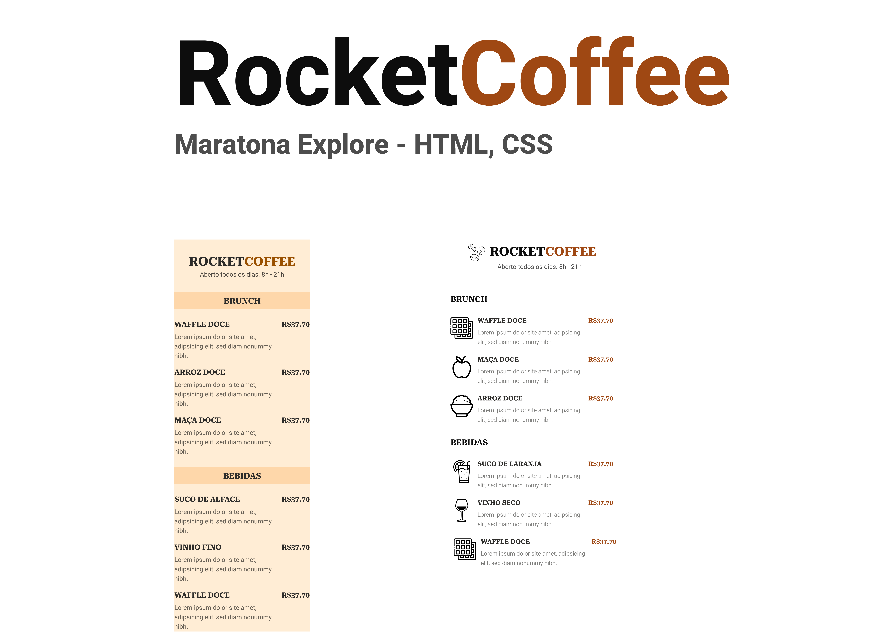
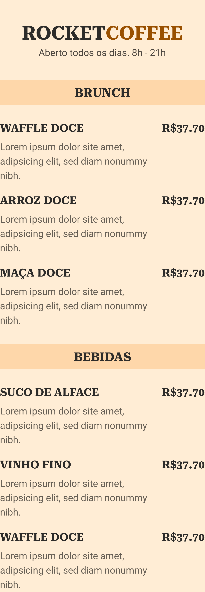
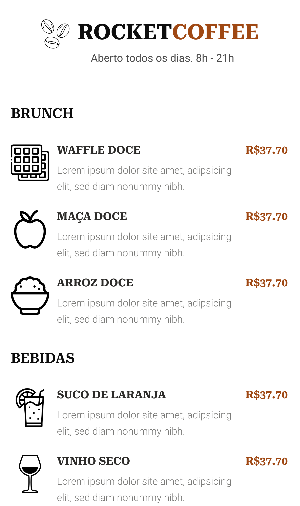
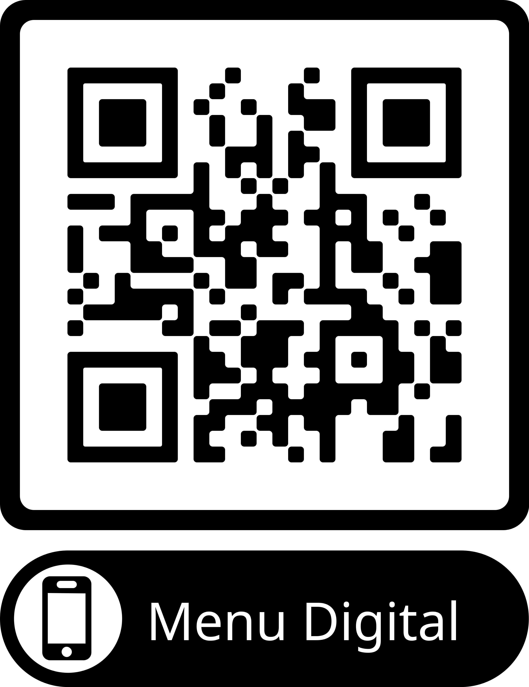

  

<h1 align="start">Rocket Coffee - Maratona Explore 3.0</h1>

  <a href="#apple-sobre">Sobre</a> &#xa0; | &#xa0;
  <a href="#-cardápios">Cardápios</a> &#xa0; | &#xa0;
  <a href="#checkered_flag-para-inicializar-o-projeto">Inciando o projeto</a> &#xa0; | &#xa0;
  <a href="#-autor">Autor</a>

 

## :apple: Sobre ##

Projeto foi desenvolvido durante as aulas do Maratona Explore 3 da Rocketseat, o qual é um cardápio digital que pode ser encontrado através da leitura de um QR Code.

# Descrição do projeto

 O projeto dessa edição foi um menu digital que pode ser acessado através de qualquer smartphone que leia o QR Code, as tecnologias utilizadas foram HTML5, CSS e o figma para o design do cardápio.

 

## 🔍 Cardápios ##

Cardápio Original

  

Cardápio Refeito

  

## :checkered_flag: Para inicializar o projeto ##

Com seu smartphone, abra a câmera e leia o QRCode abaixo

  

## 👽 Autor ##

Feito com :heart: por Stênio Ellison

&#xa0;

<a href="#top">Back to top</a>

